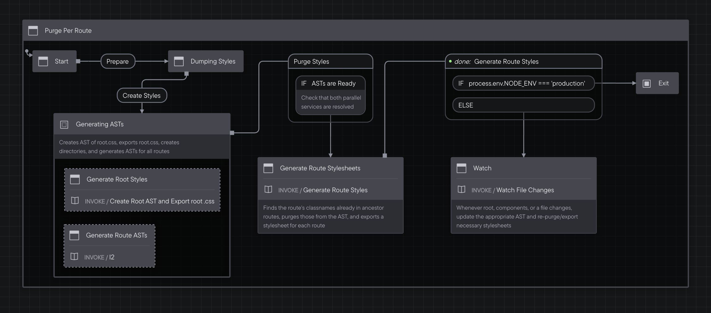

# Tailwind Purge-Per-Route Demo

This is a demo for creating tailwind stylesheets for routes that purge based on the entire ancestry of the route.

Feel free to play with the [live demo](https://purge-per-route.vercel.app). To see the CSS splitting per route, open up your Network tab and hover/click on all the links!

Here is a video that explains what's going on and why it's so cool!

[](https://www.youtube.com/watch?v=hGtdtDVUxIg)

## How does it work

All of the magic is in [scripts/styles.js](./scripts/styles.js)

I tried to make the logic as clean as possible, but it's still a solid 500 lines and was built for a demo, so it might not be the most production ready code you've seen.

To help orient you around how the logic roughly works, here it is [represented as a statechart](https://stately.ai/registry/editor/105a41c2-1cd9-41a9-a27a-324c71bfb735) (note: the actually logic is not an explicit statechart).



## Getting started

- Install dependencies:

  ```sh
  npm run install
  ```

- Start dev server:

  ```sh
  npm run dev
  ```

And you should be good to go!

## How this project was developed

This project was started with the [Indie Stack](https://github.com/remix-run/indie-stack).

A lot of the bits have been removed, such as ƒly, prisma, and mocking and testing

To get started with the Indie stack on a separate project, simply run:

```
npx create-remix --template remix-run/indie-stack
```

Additionally, this demo leverages lots of free sample components/views from Tailwind UI: https://tailwindui.com/

Tailwind UI is a very cool paid product from Tailwind Labs (the company behind Tailwind CSS). Using Tailwind UI was the quickest way to add a bunch of tailwind classes to demonstrate the power behind the idea in this repository.
